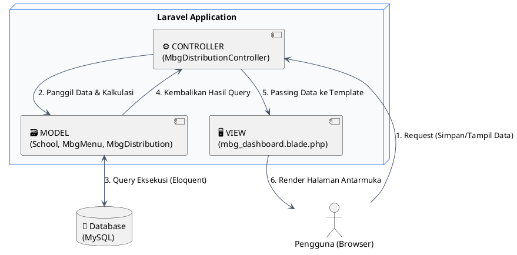
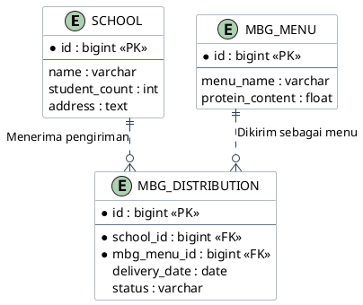

# NutriGate - MBG Logistics Management

<div align="center">
  
  
  
  
</div>

<br>

NutriGate adalah sistem informasi logistik berbasis web yang dikembangkan khusus untuk mengelola jalur distribusi program Makan Bergizi Gratis (MBG). Sistem ini berfungsi untuk mendata sekolah penerima, mencatat jadwal pengiriman makanan harian, hingga melakukan perhitungan otomatis terhadap total serapan protein yang disalurkan di lapangan.

Aplikasi ini dibangun menggunakan framework Laravel dengan fokus pada sentralisasi data, kemudahan pelacakan logistik, dan akurasi kalkulasi gizi guna meminimalisir kesalahan perhitungan manual.

---

## Arsitektur Aplikasi (Pola MVC)

Untuk menjaga kualitas dan skalabilitas kode, proyek ini memisahkan logika aplikasi ke dalam arsitektur **Model-View-Controller (MVC)**. Berikut adalah alur komunikasi antar komponen (*Request Lifecycle*) yang disajikan menggunakan standar PlantUML:



### Pemetaan Detail Komponen MVC

Pemisahan tugas ini mencegah penumpukan kode pada satu *layer* (lapisan). Penjelasan tugas spesifik untuk setiap komponen dirangkum pada tabel berikut:

| Komponen (Layer) | Letak Direktori Utama | Peran & Tanggung Jawab Operasional |
| :--- | :--- | :--- |
| **Model** (Data) | `app/Models/` | Bertugas menangani komunikasi langsung dengan database. Layer ini menggunakan Eloquent ORM untuk mendefinisikan struktur tabel, menjaga relasi antar data (misal: relasi tabel `School` dan `MbgMenu`), serta mengeksekusi operasi baca-tulis ke MySQL. |
| **Controller** (Logika) | `app/Http/Controllers/` | Bertindak sebagai otak aplikasi yang menjembatani View dan Model. Controller ini menangani validasi *form* dari user, menjalankan logika matematika (seperti perkalian otomatis jumlah murid dengan gram protein), dan menentukan respons apa yang akan dikirim kembali. |
| **View** (Antarmuka) | `resources/views/` | Lapisan terluar yang murni digunakan untuk menampilkan *User Interface* (UI). Dibangun dengan sistem *templating* Blade, dikombinasikan dengan Tailwind CSS untuk pengaturan tata letak, dan Alpine.js untuk interaksi komponen *pop-up* tanpa memuat ulang halaman. |

### Struktur Folder Inti

Peta letak file utama pembentuk aplikasi:

```text
📦 nutrigate-mbg-system
 ┣ 📂 app
 ┃ ┣ 📂 Http
 ┃ ┃ ┗ 📂 Controllers
 ┃ ┃   ┗ 📜 MbgDistributionController.php   # (CONTROLLER) Pusat logika dan kalkulasi data
 ┃ ┗ 📂 Models
 ┃   ┣ 📜 MbgDistribution.php               # (MODEL) Skema tabel jadwal distribusi
 ┃   ┣ 📜 MbgMenu.php                       # (MODEL) Skema tabel katalog menu gizi
 ┃   ┗ 📜 School.php                        # (MODEL) Skema tabel data sekolah mitra
 ┣ 📂 resources
 ┃ ┗ 📂 views
 ┃   ┗ 📜 mbg_dashboard.blade.php           # (VIEW) Kode antarmuka halaman utama admin
 ┗ 📂 database
   ┗ 📜 nutrigate_db.sql                    # File dump database untuk instalasi cepat
```

---

## Skema Relasi Database (ERD)

Struktur data aplikasi ini ditopang oleh tiga entitas utama. Berikut adalah pemetaan *Entity-Relationship Diagram* menggunakan PlantUML dengan garis relasi *orthogonal* agar terstruktur rapi dan tidak tumpang tindih:



---

## Fungsionalitas Sistem

1. **Kalkulator Gizi Otomatis:** Admin tidak perlu lagi melakukan perhitungan manual. Saat proses penjadwalan, sistem akan langsung mengalikan variabel jumlah siswa di sekolah target dengan spesifikasi protein pada paket menu yang dipilih, menghasilkan total kebutuhan kotak makan dan gram protein secara *real-time*.
2. **Dasbor Analitik & Metrik:** Panel kontrol utama menampilkan ringkasan rekapitulasi data distribusi harian. Dilengkapi integrasi Chart.js untuk memvisualisasikan proporsi status pengiriman dalam bentuk grafik.
3. **Pendaftaran Entitas Sekolah:** Modul khusus yang memungkinkan penambahan data instansi sekolah baru ke dalam jaringan distribusi, lengkap dengan penetapan kuota siswa aktif.
4. **Manajemen Katalog Menu:** Fasilitas untuk menginput daftar variasi menu makanan baru beserta komposisi lauk dan takaran gizi (protein) untuk rotasi pengiriman harian.
5. **Siklus Status Pengiriman (CRUD):** Kemampuan untuk mencatat jadwal distribusi baru, mengedit kesalahan input, menghapus riwayat, serta memperbarui progres pengiriman secara berjenjang (*Diproses -> Dikirim -> Selesai*).

---

## Dokumentasi Antarmuka (Screenshots)

Tampilan antarmuka panel logistik NutriGate:

### 1. Dasbor Utama & Visualisasi Analitik Data
Pusat pemantauan distribusi yang menampilkan metrik protein harian dan grafik status pengiriman logistik.
<p align="center">
  
</p>

### 2. Panel Pendaftaran Sekolah Mitra Baru
Antarmuka untuk menginput data sekolah penerima baru, mencakup penetapan alamat dan jumlah siswa sebagai basis penentu kuota makanan.
<p align="center">
  
</p>

### 3. Modul Penyusunan Katalog Menu Gizi
Formulir untuk mendaftarkan variasi menu makanan baru beserta perhitungan besaran protein per porsinya.
<p align="center">
  
</p>

---

## Panduan Instalasi Lokal (Localhost Development)

Panduan berikut digunakan jika Anda ingin menjalankan dan menguji proyek ini di laptop. Syarat utama yang perlu disiapkan adalah **PHP (versi 8.2 ke atas)**, **Composer**, dan aplikasi penyedia database lokal seperti **XAMPP** atau **Laragon**.

### 1. Kloning Repositori
Buka terminal direktori kerja Anda, lalu jalankan perintah ini untuk mengunduh source code:
```bash
git clone [https://github.com/Adin725/nutrigate-mbg-system.git](https://github.com/Adin725/nutrigate-mbg-system.git)
cd nutrigate-mbg-system
```

### 2. Instalasi Dependensi
Unduh dan pasang seluruh *library* PHP yang dibutuhkan Laravel melalui Composer:
```bash
composer install
```

### 3. Konfigurasi Database
Buat salinan file pengaturan lingkungan (environment) aplikasi:
```bash
cp .env.example .env
```
Buka file `.env` tersebut, temukan blok database, dan sesuaikan dengan kredensial MySQL lokal Anda:
```ini
DB_CONNECTION=mysql
DB_HOST=127.0.0.1
DB_PORT=3306
DB_DATABASE=nutrigate_db
DB_USERNAME=root
DB_PASSWORD=
```

### 4. *Generate Application Key*
Buat kunci enkripsi unik untuk mengamankan *session* dan data aplikasi:
```bash
php artisan key:generate
```

### 5. Migrasi dan Injeksi Data Uji (*Seeding*)
Pastikan service MySQL Anda sudah berjalan. Eksekusi perintah ini untuk membuat seluruh tabel yang dibutuhkan secara otomatis sekaligus mengisi data contoh awal:
```bash
php artisan migrate:fresh --seed
```
*(Catatan alternatif: Anda bisa langsung mengimpor file mentahan `nutrigate_db.sql` melalui phpMyAdmin ke dalam database kosong jika tidak ingin menjalankan perintah migrate).*

### 6. Menjalankan Server Lokal
Aktifkan *development server* Laravel dengan perintah:
```bash
php artisan serve
```
Aplikasi sudah siap digunakan. Buka browser dan akses halaman `http://127.0.0.1:8000`.

---

## Profil Pengembang

Dokumentasi dan proyek aplikasi ini dikembangkan untuk keperluan implementasi arsitektur pemrograman web:

* **Rijaluddin Abdul Ghani**
* Mahasiswa Program Studi Informatika, Universitas Syiah Kuala.
* GitHub: [@Adin725](https://github.com/Adin725)
