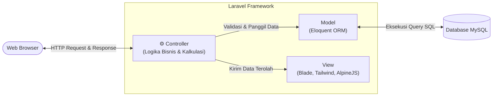
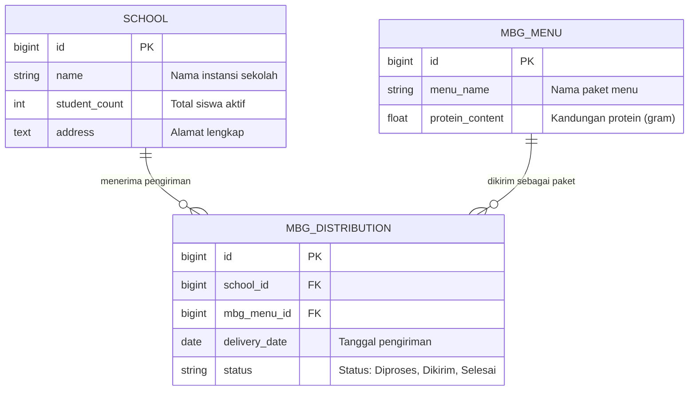
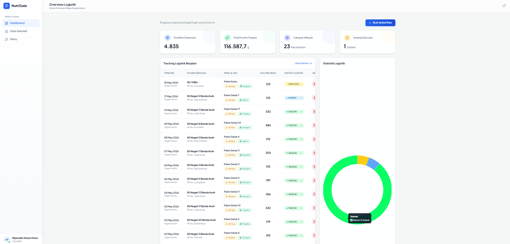
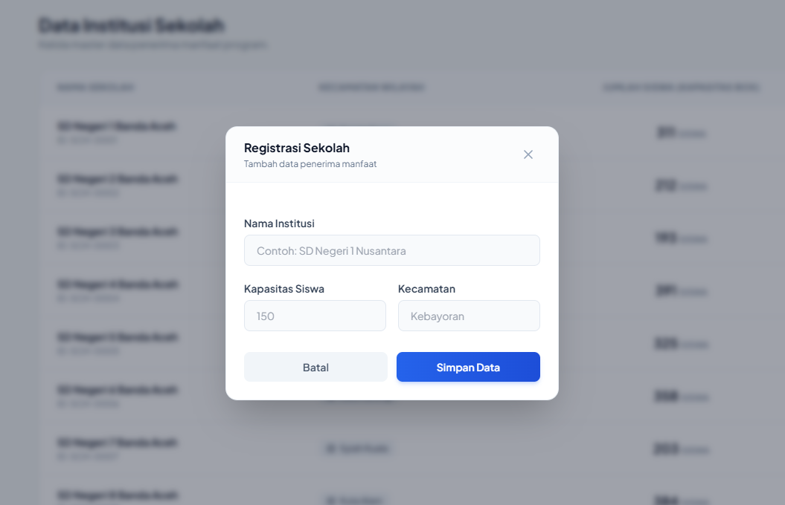
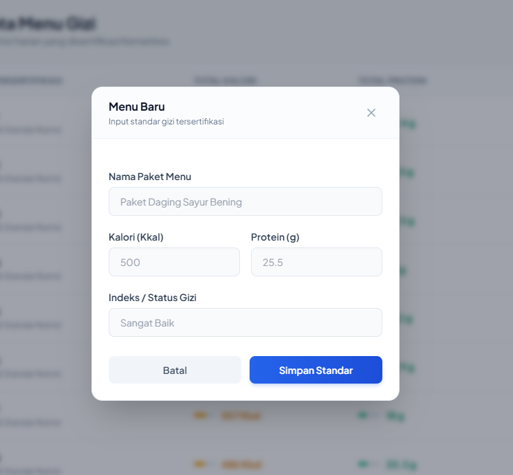

# NutriGate - MBG Logistics Management

<div align="center">
  
  
  
  
</div>

<br>

NutriGate merupakan platform manajemen logistik berbasis web yang dikembangkan khusus untuk mengelola operasional distribusi program Makan Bergizi Gratis (MBG). Sistem ini dirancang untuk mendata sekolah penerima, mencatat jadwal pengiriman makanan, dan mengotomatisasi perhitungan total serapan protein yang disalurkan harian.

Aplikasi ini mengutamakan sentralisasi data, kemudahan pelacakan riwayat logistik, serta akurasi kalkulasi gizi guna menghindari kesalahan perhitungan manual di lapangan.

---

## Arsitektur Sistem (Pola MVC)

Proyek ini memisahkan logika pemrosesan, interaksi database, dan antarmuka pengguna melalui implementasi arsitektur **Model-View-Controller (MVC)**. Berikut adalah alur komunikasi antar komponen di dalam sistem:



### Pemetaan Detail Komponen MVC

Pemisahan tugas ini memastikan kode tidak menumpuk di satu tempat. Penjelasan tugas spesifik untuk setiap komponen dirangkum pada tabel berikut:

| Lapisan | Letak Direktori | Peran & Tanggung Jawab Operasional |
| :--- | :--- | :--- |
| **Model** | `app/Models/` | Menangani komunikasi langsung dengan database. Layer ini bertugas mendefinisikan skema tabel, mengatur relasi data (seperti hubungan data Sekolah dan Menu), serta menjalankan *query* ke basis data MySQL. |
| **Controller** | `app/Http/Controllers/` | Bertindak sebagai pusat kendali. Menerima input dari pengguna, memproses perhitungan otomatis (misal: jumlah siswa dikali kandungan protein), lalu menentukan data mana yang akan dikirim ke antarmuka. |
| **View** | `resources/views/` | Lapisan presentasi yang menyajikan antarmuka pengguna (UI). Dibangun menggunakan *template engine* Blade, dirapikan dengan Tailwind CSS, dan menggunakan Alpine.js untuk interaktivitas elemen dinamis seperti modal form. |

📦 nutrigate-mbg-system
 ┣ 📂 app
 ┃ ┣ 📂 Http
 ┃ ┃ ┗ 📂 Controllers
 ┃ ┃   ┗ 📜 MbgDistributionController.php   # (CONTROLLER) Pusat logika dan kalkulasi data
 ┃ ┗ 📂 Models
 ┃   ┣ 📜 MbgDistribution.php               # (MODEL) Skema tabel jadwal distribusi
 ┃   ┣ 📜 MbgMenu.php                       # (MODEL) Skema tabel katalog menu gizi
 ┃   ┗ 📜 School.php                        # (MODEL) Skema tabel data sekolah mitra
 ┣ 📂 database
 ┃ ┣ 📂 migrations                           # Skema pembuatan tabel database
 ┃ ┗ 📂 seeders                              # Data dummy awal untuk pengujian
 ┣ 📂 resources
 ┃ ┗ 📂 views
 ┃   ┗ 📜 mbg_dashboard.blade.php           # (VIEW) Kode antarmuka halaman utama admin
 ┗ 📜 nutrigate_db.sql                      # File backup database (SQL Dump) di root project


## Skema Relasi Database (ERD)

Struktur data aplikasi ini terdiri dari tiga entitas utama yang saling berelasi. Berikut adalah pemetaan *Entity-Relationship Diagram* yang mendasari sistem penyimpanan data:



---

## Fitur Utama Sistem

1. **Kalkulasi Gizi Otomatis:** Saat penambahan jadwal distribusi, sistem akan langsung mengalikan jumlah siswa di sekolah target dengan spesifikasi protein dari paket menu yang dipilih. Proses ini menghasilkan perhitungan kebutuhan kotak makan dan total gram protein secara presisi.
2. **Dasbor Metrik & Analitik:** Panel kontrol utama menyediakan ringkasan visualisasi data. Dilengkapi integrasi Chart.js untuk memantau proporsi status pengiriman secara *real-time*.
3. **Manajemen Registrasi Sekolah:** Modul pendataan yang berfungsi memasukkan entitas sekolah baru ke dalam jaringan distribusi logistik, lengkap dengan pengaturan kuota siswa aktif.
4. **Penyusunan Katalog Menu:** Fasilitas bagi admin untuk mendaftarkan variasi menu makanan baru beserta komposisi lauk dan takaran protein per porsinya.
5. **Manajemen Siklus Distribusi (CRUD):** Fungsionalitas penuh untuk mencatat jadwal pengiriman, memperbaiki kesalahan input data, menghapus riwayat, serta mengelola status pergerakan logistik (*Diproses -> Dikirim -> Selesai*).

---

## Dokumentasi Antarmuka (Screenshots)

Berikut adalah rekam visual antarmuka sistem yang dikendalikan oleh Admin:

### 1. Dasbor Utama & Visualisasi Analitik Data
Pusat kendali operasional yang menampilkan rekapitulasi data distribusi harian dan grafik lingkaran status pengiriman logistik.
<p align="center">
  
</p>

### 2. Modul Pendaftaran Sekolah Mitra Baru
Antarmuka formulir yang dirancang untuk mendaftarkan instansi sekolah penerima yang baru, mencakup lokasi geografis dan total siswa sebagai basis kuota distribusi makanan.
<p align="center">
  
</p>

### 3. Modul Manajemen Katalog Menu Gizi
Formulir pendataan paket menu makanan baru yang mencatat rincian menu beserta nilai kandungan gizi protein spesifik.
<p align="center">
  
</p>

---

## Panduan Instalasi (Development Environment)

Panduan berikut digunakan untuk menjalankan dan menguji proyek aplikasi di lingkungan lokal. Prasyarat yang dibutuhkan meliputi **PHP (minimal versi 8.2)**, **Composer**, serta server basis data lokal seperti **XAMPP** atau **Laragon**.

### 1. Kloning Repositori
Jalankan perintah berikut di dalam terminal untuk mengunduh source code aplikasi:
```bash
git clone [https://github.com/Adin725/nutrigate-mbg-system.git](https://github.com/Adin725/nutrigate-mbg-system.git)
cd nutrigate-mbg-system
```

### 2. Pemasangan Dependensi
Gunakan Composer untuk menginstal seluruh *library* PHP yang menjadi kerangka aplikasi:
```bash
composer install
```

### 3. Konfigurasi Lingkungan
Buat salinan file pengaturan (environment) aplikasi:
```bash
cp .env.example .env
```
Buka file `.env` dan atur parameter koneksi database agar sesuai dengan server lokal Anda:
```ini
DB_CONNECTION=mysql
DB_HOST=127.0.0.1
DB_PORT=3306
DB_DATABASE=nutrigate_db
DB_USERNAME=root
DB_PASSWORD=
```

### 4. *Generate Application Key*
Buat kunci enkripsi sesi aplikasi:
```bash
php artisan key:generate
```

### 5. Migrasi dan Injeksi Data Uji (*Seeding*)
Pastikan service MySQL di lokal Anda telah berjalan. Eksekusi perintah berikut untuk secara otomatis membuat tabel dan mengisi data awal:
```bash
php artisan migrate:fresh --seed
```
*(Alternatif: Anda dapat mengimpor file `nutrigate_db.sql` secara manual melalui antarmuka phpMyAdmin jika tidak menggunakan fitur migrate).*

### 6. Menjalankan Server Lokal
Nyalakan *development server* bawaan Laravel:
```bash
php artisan serve
```
Aplikasi berhasil dijalankan dan dapat diakses melalui browser pada alamat `http://127.0.0.1:8000`.

---

## Profil Pengembang

Aplikasi ini dikembangkan untuk keperluan implementasi tugas perancangan web tingkat lanjut:

* **Rijaluddin Abdul Ghani**
* Mahasiswa Program Studi Informatika, Universitas Syiah Kuala.
* GitHub: [@Adin725](https://github.com/Adin725)
