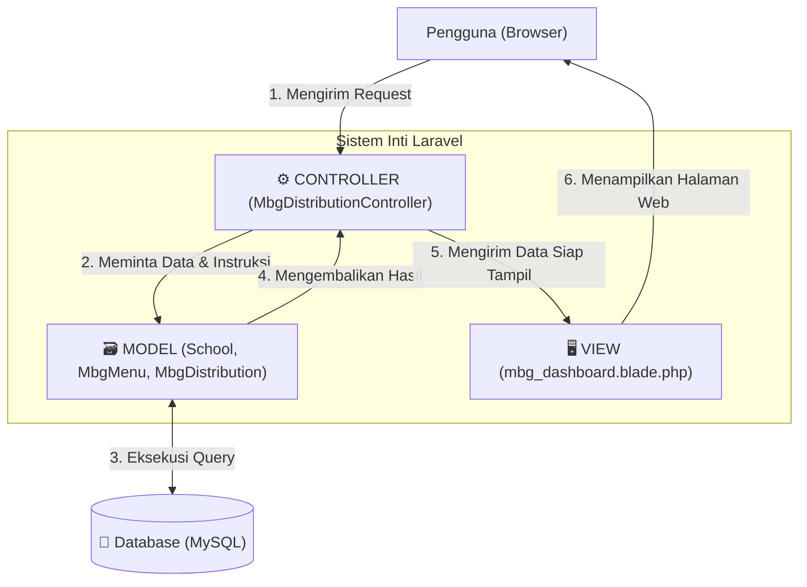
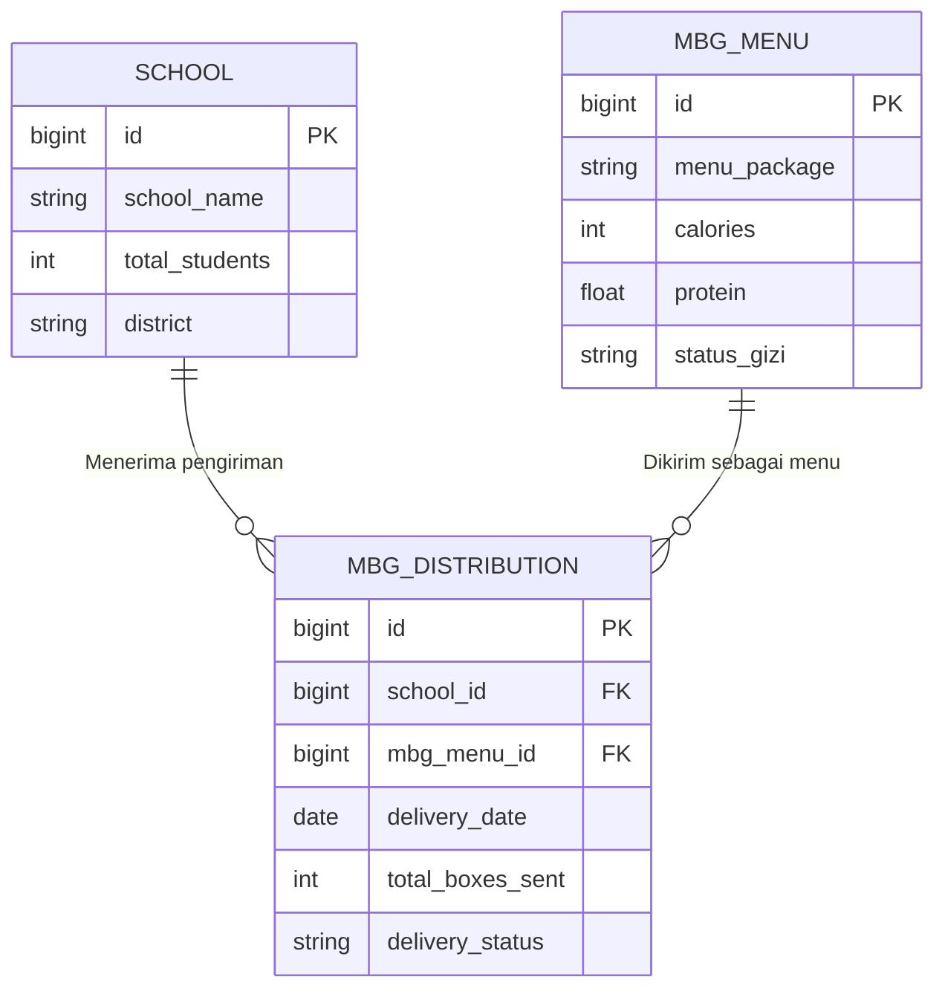

# NutriGate - MBG Logistics Management

<div align="center">
  
  
  
  
</div>

<br>

NutriGate adalah sistem informasi logistik berbasis web yang dibangun secara khusus untuk mengawal jalannya program Makan Bergizi Gratis (MBG). Sistem ini dirancang untuk mendata sekolah penerima, mencatat setiap jadwal pengiriman makanan, hingga menghitung secara otomatis berapa banyak kandungan protein yang disalurkan setiap harinya.

Pengembangan aplikasi ini menggunakan framework Laravel dengan tujuan utama memastikan data distribusi tetap terpusat, mudah dilacak, dan meminimalisir kesalahan perhitungan gizi di lapangan.

---

## Arsitektur Aplikasi (Konsep MVC)

Untuk menjaga agar kode tetap rapi dan mudah dikembangkan ke depannya, proyek ini sepenuhnya menerapkan pola desain **Model-View-Controller (MVC)**. Secara garis besar, alur kerja aplikasinya berjalan seperti pada diagram berikut:



### Detail Tugas Masing-Masing Komponen

Setiap bagian dalam konsep MVC di atas memiliki peran spesifik agar kode tidak menumpuk di satu tempat:

* **Model (Pengelola Data):** Bertugas mengatur segala urusan dengan database. Model di aplikasi ini menggunakan fitur Eloquent ORM dari Laravel untuk mengatur hubungan antar data, misalnya mencocokkan data sekolah dengan paket menu yang akan dikirim.
* **Controller (Otak Aplikasi):** Bagian ini adalah pusat kendali. Saat ada jadwal pengiriman baru yang diinput, Controller yang akan memproses hitung-hitungannya (seperti mengalikan jumlah murid dengan kandungan protein) sebelum akhirnya menyimpannya ke database.
* **View (Tampilan Visual):** Murni berfungsi untuk menampilkan data ke layar pengguna. Antarmuka ini dibangun menggunakan *engine* Blade dari Laravel, dipercantik dengan Tailwind CSS, dan diberi efek interaktif (seperti *pop-up* form) menggunakan Alpine.js.

### Struktur Direktori Folder

Sebagai gambaran letak file-file penting yang menyusun aplikasi ini, berikut adalah peta struktur direktorinya:

```text
📦 nutrigate-mbg-system
 ┣ 📂 app
 ┃ ┣ 📂 Http
 ┃ ┃ ┗ 📂 Controllers
 ┃ ┃   ┗ 📜 MbgDistributionController.php   # (CONTROLLER) Pusat logika dan kalkulasi data
 ┃ ┗ 📂 Models
 ┃   ┣ 📜 MbgDistribution.php               # (MODEL) Skema tabel jadwal distribusi
 ┃   ┣ 📜 MbgMenu.php                       # (MODEL) Skema tabel katalog menu gizi
 ┃   ┗ 📜 School.php                        # (MODEL) Skema tabel data sekolah mitra
 ┣ 📂 resources
 ┃ ┗ 📂 views
 ┃   ┗ 📜 mbg_dashboard.blade.php           # (VIEW) Kode antarmuka halaman utama admin
 ┗ 📂 database
   ┗ 📜 nutrigate_db.sql                    # File mentahan database untuk di-import
```

---

## Skema Relasi Database (ERD)

Aplikasi ini ditopang oleh tiga tabel utama yang saling berhubungan. Berikut adalah visualisasi *Entity-Relationship Diagram* yang menunjukkan bagaimana data-data logistik tersebut saling mengikat dan merepresentasikan kolom aslinya di database:



---

## Fitur Unggulan Sistem

1. **Kalkulator Gizi Pintar:** Pengguna tidak perlu lagi menghitung manual. Saat menjadwalkan distribusi, sistem akan otomatis mengalikan jumlah siswa di sekolah tersebut dengan kandungan gizi pada menu yang dipilih. Hasil akhirnya berupa total kebutuhan kotak makan dan total gram protein.
2. **Dasbor Ringkasan Interaktif:** Terdapat panel metrik utama di bagian atas aplikasi yang langsung merekap total distribusi hari ini, dilengkapi dengan grafik lingkaran (Chart.js) untuk melihat perbandingan status pengiriman.
3. **Manajemen Logistik Terpadu (CRUD):** Admin bebas melakukan penambahan jadwal baru, mengubah data jika ada kesalahan, menghapus riwayat, serta memperbarui status pengiriman (*Diproses -> Dikirim -> Selesai*) dengan sangat mudah.

---

## Panduan Visual (Screenshots)

Berikut ini adalah tampilan antarmuka dari aplikasi NutriGate yang akan dilihat oleh pengguna:

| Dasbor Utama & Visualisasi Grafik |
| :---: |
|  |
| **Form Penjadwalan & Pengelolaan Data Distribusi** |
|  |

> **Catatan:** Pastikan gambar *screenshot* Anda sudah diletakkan di dalam folder `public/screenshots/` dengan nama yang sesuai agar muncul di halaman ini.

---

## Cara Menjalankan Aplikasi di Laptop (Localhost)

Bagi dosen atau asisten laboratorium yang ingin menguji coba sistem ini, silakan ikuti langkah-langkah instalasi berikut. Pastikan laptop sudah terinstal **PHP (minimal versi 8.2)**, **Composer**, dan aplikasi penyedia database seperti **XAMPP** atau **Laragon**.

### 1. Persiapan Awal
Buka terminal atau *command prompt*, lalu unduh repositori ini dan masuk ke dalam foldernya:
```bash
git clone https://github.com/Adin725/nutrigate-mbg-system.git
cd nutrigate-mbg-system
```

### 2. Instalasi Kebutuhan Sistem
Jalankan perintah ini untuk menginstal semua *library* pendukung yang dibutuhkan oleh Laravel:
```bash
composer install
```

### 3. Pengaturan Database
Gandakan file konfigurasi bawaan agar aplikasi bisa terhubung ke database lokal Anda:
```bash
cp .env.example .env
```
Buka file `.env` yang baru saja terbuat, cari bagian pengaturan database, dan ubah menjadi seperti ini:
```ini
DB_CONNECTION=mysql
DB_HOST=127.0.0.1
DB_PORT=3306
DB_DATABASE=nutrigate_db
DB_USERNAME=root
DB_PASSWORD=
```

### 4. Membuat Kunci Keamanan
Jalankan perintah ini agar Laravel menghasilkan kunci enkripsi unik untuk keamanan data:
```bash
php artisan key:generate
```

### 5. Membangun Tabel Database
Pastikan MySQL Anda (di XAMPP/Laragon) sudah menyala. Jalankan perintah di bawah ini untuk membuat tabel otomatis sekaligus mengisi data contoh (data *dummy*):
```bash
php artisan migrate:fresh --seed
```
*(Sebagai alternatif, Anda juga bisa melakukan import file `nutrigate_db.sql` secara manual melalui phpMyAdmin).*

### 6. Menyalakan Server
Tahap terakhir, nyalakan server lokal Laravel dengan perintah:
```bash
php artisan serve
```
Buka browser Anda dan kunjungi tautan `http://127.0.0.1:8000` untuk melihat aplikasi NutriGate beraksi.

---

## Profil Pengembang

Proyek ini disusun dan dikembangkan sebagai bagian dari pemenuhan tugas mata kuliah Pemrograman Web:

* **Rijaluddin Abdul Ghani**
* Mahasiswa Program Studi Informatika, Fakultas MIPA, Universitas Syiah Kuala.
* GitHub: [@Adin725](https://github.com/Adin725)
